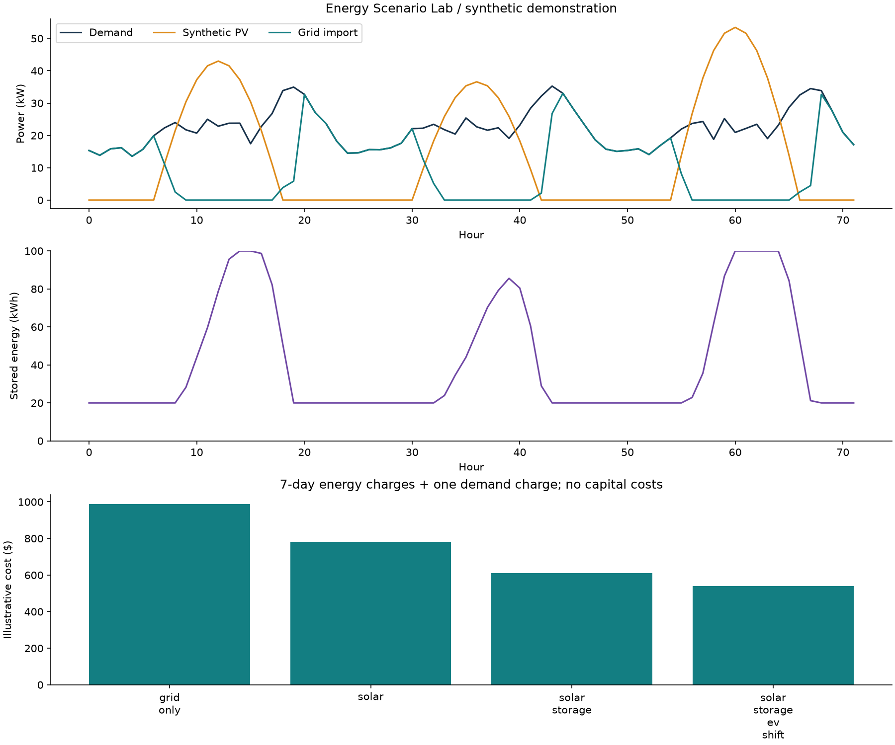
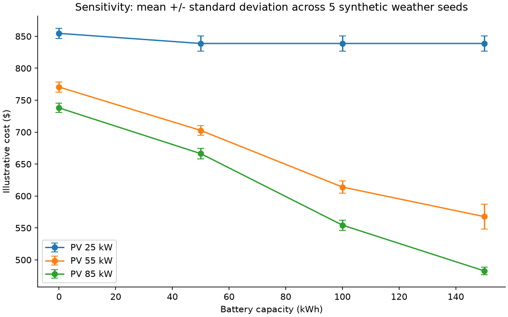
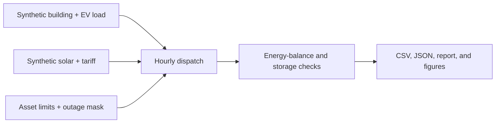

# Energy Scenario Lab

An independent Python laboratory for exploring how load timing, solar generation, storage, and backup supply affect energy cost and continuity of service.

**All data is synthetic.** This repository is a new educational implementation of general engineering concepts. It contains no employer, university, sponsor, or client code, datasets, models, tariffs, or research results. It is not affiliated with or endorsed by a research program.



## What you can investigate

- Compare grid-only, solar, solar-plus-storage, and shifted EV charging scenarios.
- Trace every hour's energy streams and check conservation at the AC bus.
- Explore peak-price, self-consumption, and reserve-oriented battery policies.
- Compare critical-load service during the same eight-hour supply interruption.
- Run 60 combinations of PV capacity, storage capacity, and invented weather seeds.
- Export hourly CSVs, JSON summaries, a Markdown report, and figures.

This project demonstrates numerical modeling, requirements-to-model translation, engineering data processing, parametric automation, verification, and communication of tradeoffs.

## Run it

Python 3.10+ is required. Use an isolated environment:

```sh
python -m venv .venv
# Windows: .venv\Scripts\activate
# macOS/Linux: source .venv/bin/activate
python -m pip install -e .
energy-lab --output outputs/demo --sweep
python -m unittest discover -s tests -v
```

The module entrypoint is equivalent: `python -m energy_lab.cli --sweep`.

Change the horizon, seed, or asset assumptions:

```sh
energy-lab --days 14 --seed 7 --config examples/asset-overrides.json --output outputs/custom
```

The JSON accepts `Assets` field names, rejects unknown names, and validates bounds. All generated output is local; there are no API keys or downloads at runtime.

## Example results

The committed [seven-day report](examples/demo/RESULTS.md) uses seed 42. The synthetic grid-only case imports about 3,718 kWh. The solar, storage, and shifted-EV case imports about 1,768 kWh. These are demonstration outputs, not savings achieved at a real site.



The error bars show standard deviation across five invented weather/load seeds, not confidence intervals or weather-risk estimates. The same seeds are reused across designs for a paired comparison.

## Model in brief



The simulator uses a one-hour step, a single AC bus, an aggregate battery, and a transparent dispatch heuristic. Solar meets demand first; surplus charges the battery, then exports up to a limit. Battery discharge follows the selected policy. Grid import and a simplified backup generator cover remaining deficits. During outages only the defined critical portion of demand is targeted, with the remainder recorded as intentionally shed.

See [model equations and boundaries](docs/MODEL.md) and [verification](docs/VERIFICATION.md). Source entry points:

- [`model.py`](src/energy_lab/model.py): validated assets, invented profiles, dispatch, accounting
- [`cli.py`](src/energy_lab/cli.py): reproducible cases, outputs, and sensitivity experiment
- [`tests/`](tests): analytical checks and randomized physical invariants

## Scope and interpretation

This is **not** AC power flow, equipment design, optimal dispatch, or an investment model. It omits voltage, reactive power, network constraints, battery degradation, generator start/ramp/minimum-run constraints, reliability probabilities, capital cost, and lifecycle economics. Solar is a shaped synthetic signal, not a site-specific PV model. An illustrative demand charge is applied once to the horizon's observed peak; a week must not be treated as a year or a real monthly bill.

Initial and final stored energy are reported. No terminal-energy credit is applied, so different ending states can bias cost comparisons. Unserved load has no monetary penalty: always read service-quality results alongside costs. The reserve policy retains energy during normal grid operation except when the grid limit cannot serve demand; it releases the reserve during outages.

## Provenance and development

Created as a public portfolio demonstration by Jordan Quinones with AI-assisted implementation. General engineering experience informed the choice of problems; this implementation, fixtures, and results were created independently for this repository. Reproducible tests are evidence of implemented checks, not proof of field validation or certification.

Future work: time-step convergence studies, more explicit generator dynamics, terminal-state normalization, independently sourced public datasets, and benchmark comparisons with a separately implemented optimizer.

MIT licensed. See [LICENSE](LICENSE).
